# 🚀 Automação de Site Estático na AWS S3 com Terraform e GitHub Actions

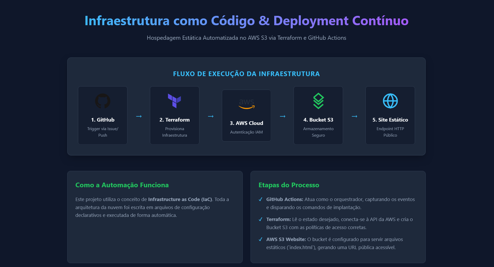
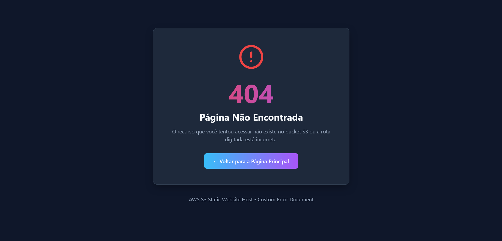

Documentação técnica de um projeto de Infraestrutura como Código (IaC) que provisionei para publicar um site estático no Amazon S3, disparado automaticamente pela abertura de uma *Issue* no GitHub.

> ⚠️ **Contexto do problema de negócio:** uma empresa precisa de infraestrutura como código para suas *workloads*, eliminando a configuração manual pelo console da AWS. Projetei essa automação para que o site estático possa subir ou ser destruído de forma **escalável** e **repetível**, sem intervenção humana no provisionamento.

---

## ☁️ Conceitos de nuvem aplicados neste projeto

| Conceito | Onde apliquei no projeto |
|---|---|
| **IaaS** | Usei o Terraform para provisionar o recurso de infraestrutura (bucket S3) de forma declarativa |
| **SaaS** | Usei o GitHub Actions que é uma ferramenta de CI/CD pronto, que só configurei via YAML, sem administrar nenhuma plataforma ou servidor por trás
| **Elasticidade** | O bucket S3 escala o armazenamento automaticamente conforme a demanda, sem eu precisar provisionar disco |
| **Escalabilidade** | O site aguenta picos de acesso sem qualquer alteração na infraestrutura que criei |
| **Modelo de responsabilidade compartilhada** | A AWS garante a infraestrutura física e a disponibilidade do serviço S3; eu fiquei responsável pela configuração de acesso (IAM, bucket policy, permissões) |
| **Menor privilégio** | Apliquei esse princípio tanto nas permissões de bucket (bloqueio público por padrão) quanto no `GITHUB_TOKEN` (leitura por padrão, escrita só quando declarada) |

---

## 📌 Visão geral do fluxo

```
Issue aberta no GitHub
        │
        ▼
GitHub Actions dispara o workflow
        │
        ▼
Configuro credenciais AWS temporárias
        │
        ▼
Terraform + AWS CLI provisionam o bucket S3
        │
        ▼
Configuro o bucket (público, website, ACL)
        │
        ▼
Envio o conteúdo do site (aws s3 sync)
        │
        ▼
Comento na Issue confirmando a conclusão
        │
        ▼
Site estático publicado e acessível
```

1. **Disparo:** abro uma nova *Issue* no repositório.
2. **Sanitização:** extraio e formato o título da *Issue* para virar o nome do bucket.
3. **Provisionamento (IaC):** o Terraform cria e configura o bucket S3.
4. **Deploy:** sincronizo os arquivos estáticos (`index.html`, `404.html`) no bucket.
5. **Notificação:** o workflow comenta na *Issue* confirmando a conclusão.

---

## 📂 Estrutura do repositório

```
.
├── .github/
│   └── workflows/
│       └── provision-s3-static-site.yaml
├── images/
│   ├── workflows_github.png
│   ├── erro_autenticação.png
│   ├── erro_s3GetBucketObjectLockConfiguration.png
│   ├── buckets_da_conta.png
│   ├── sem_politica_bucket.png
│   ├── erro_403_Forbidden.png
│   ├── politica_bucket.png
│   ├── bucket_sem_objetos.png
│   ├── objetos_do_bucket.png
│   ├── 404.png
│   ├── 404_not_found.png
│   ├── upload_index.html_404.html.png
│   ├── Error Unhandled error HttpError Resource not accessible by integration.png
│   └── Home.png
├── site/
│   ├── index.html
│   └── 404.html
├── terraform/
│   └── s3_bucket_static_pasta/
│       └── main.tf
└── README.md
```

---

## 🛠️ Fluxo de execução detalhado — erros e soluções

Registrei cronologicamente cada erro real que enfrentei, por que ele aconteceu e como resolvi.

### 1️⃣ Disparo do workflow pela Issue

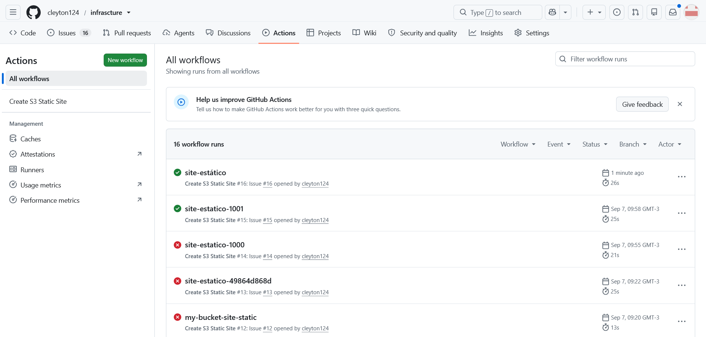

Configurei a automação de CI/CD para escutar o evento de abertura de Issue:

```yaml
on:
  issues:
    types: [opened]
```

Extraí e limpei o título da *Issue* (minúsculas, sem acentos/caracteres especiais) para usá-lo como nome do bucket:

```yaml
- name: Extract Bucket Name from Issue
  id: get_bucket
  run: |
    CLEAN_NAME=$(echo "${{ github.event.issue.title }}" | tr '[:upper:]' '[:lower:]' | tr -cd 'a-z0-9-')
    echo "BUCKET_NAME=$CLEAN_NAME" >> $GITHUB_ENV
```

> 💡 **Aprendizado:** entendi que o GitHub Actions me entrega CI/CD orientado a eventos pronto pra usar.
---

### 2️⃣ Falha de autenticação com a AWS

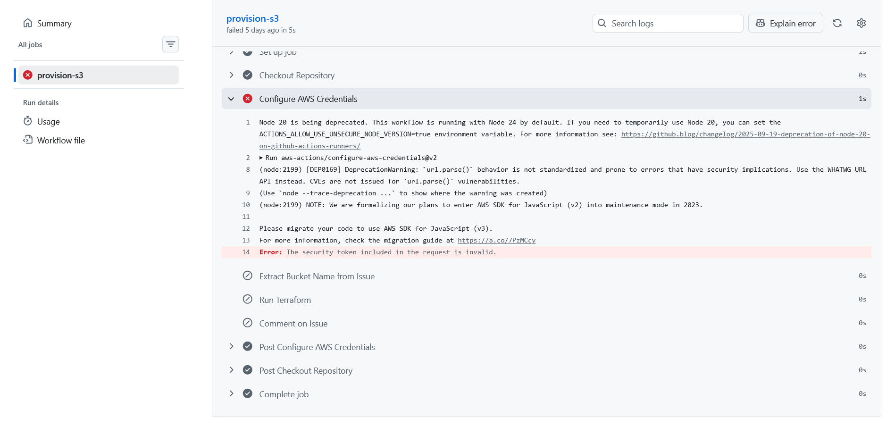

* **Erro:** token de sessão expirado (`ExpiredToken` / `The security token included in the request is invalid`).
* **Causa raiz:** identifiquei que a conta do laboratório usa credenciais **temporárias**, com validade curta, e a sessão expirou durante a execução no GitHub Actions.
* **Solução:** busquei credenciais novas e atualizei os *Secrets* no GitHub.

> 💡 **Aprendizado:** compreendi que credenciais temporárias (via STS) são uma aplicação prática do **menor privilégio** combinada a limite de tempo e reduzem a janela de exposição caso vazem, mas exigem gerenciamento ativo do ciclo de vida das credenciais.

---

### 3️⃣ Bloqueio de permissão no Terraform (Object Lock)

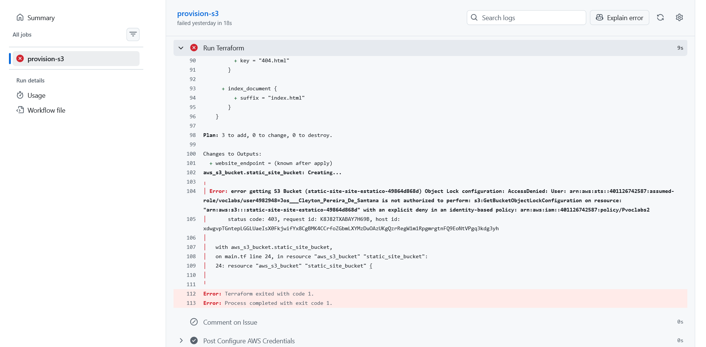

* **Erro:**
  ```
  Error: error getting S3 Bucket Object Lock configuration: AccessDenied
  ... is not authorized to perform: s3:GetBucketObjectLockConfiguration
  with an explicit deny in an identity-based policy: arn:aws:iam::...:policy/Pvoclabs2
  ```
* **Causa raiz:** investiguei e descobri que o recurso nativo `aws_s3_bucket` do provider Terraform executa automaticamente uma leitura completa do bucket logo após criá-lo, incluindo a configuração de Object Lock. A política `Pvoclabs2` do laboratório aplica um **explicit deny** nessa chamada específica, bloqueando a leitura.
* **Solução:** substituí o recurso declarativo `aws_s3_bucket` por um `null_resource`, orquestrando a criação de forma imperativa via **AWS CLI**, contornando a chamada automática do provider:

```hcl
resource "null_resource" "static_site_bucket" {
  triggers = {
    bucket_name = local.full_bucket_name
  }

  provisioner "local-exec" {
    command = <<-EOT
      set -e
      aws s3api create-bucket \
        --bucket ${local.full_bucket_name} \
        --region us-west-2 \
        --create-bucket-configuration LocationConstraint=us-west-2

      aws s3api put-public-access-block \
        --bucket ${local.full_bucket_name} \
        --public-access-block-configuration BlockPublicAcls=false,IgnorePublicAcls=false,BlockPublicPolicy=false,RestrictPublicBuckets=false

      aws s3api put-bucket-ownership-controls \
        --bucket ${local.full_bucket_name} \
        --ownership-controls '{"Rules":[{"ObjectOwnership":"BucketOwnerPreferred"}]}'

      aws s3api put-bucket-acl \
        --bucket ${local.full_bucket_name} \
        --acl public-read

      aws s3api put-bucket-website \
        --bucket ${local.full_bucket_name} \
        --website-configuration '{"IndexDocument":{"Suffix":"index.html"},"ErrorDocument":{"Key":"404.html"}}'
    EOT
  }
}
```

OBS: passei muitas horas investigando esse problema e foi o que mais me custou tempo no projeto.

> 💡 **Aprendizado:** esse erro me fez enxergar na prática o **modelo de responsabilidade compartilhada**: a AWS garante a infraestrutura e a disponibilidade do serviço S3, mas a segurança de acesso (as políticas IAM aplicadas à minha conta) é responsabilidade de quem administra a conta e, mesmo sem poder alterá-la, precisei adaptar minha arquitetura para respeitá-la. Também aprendi que, quando um recurso declarativo faz chamadas "escondidas" que minha conta não pode executar, a solução é orquestrar aquela etapa de forma imperativa via CLI.

---

### 4️⃣ Bucket provisionado com sucesso

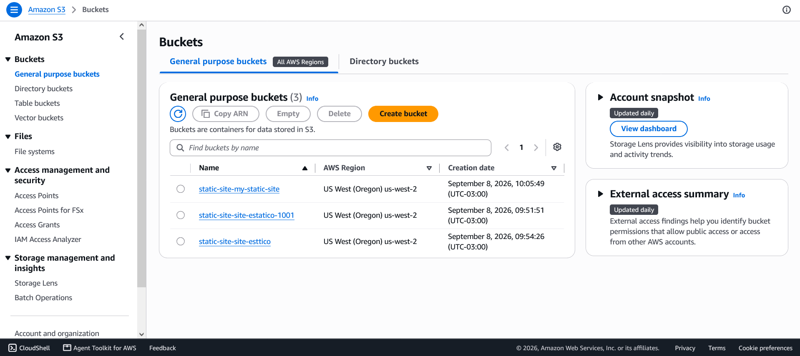

Com o `null_resource` no lugar do `aws_s3_bucket`, executei o `terraform apply` sem bater na permissão bloqueada, e o bucket passou a aparecer corretamente listado na conta.

---

### 5️⃣ Bucket sem política de acesso público

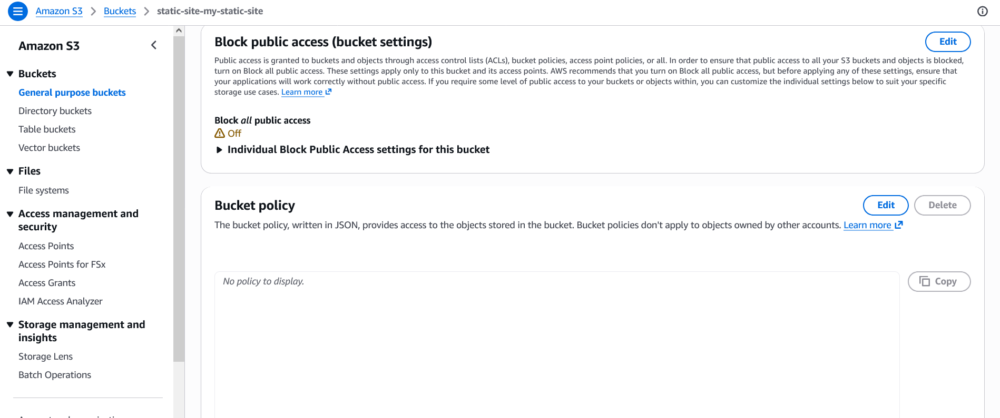
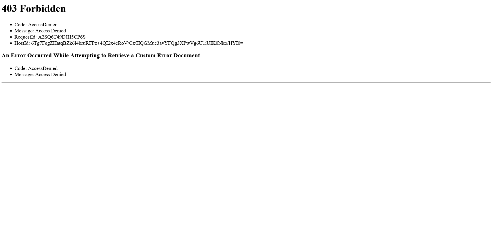

* **Erro:** `403 Forbidden` ao tentar acessar o endpoint do site.
* **Causa raiz:** identifiquei que, por padrão, o S3 bloqueia toda leitura pública de objetos para manter o **princípio de menor privilégio**, mesmo com o *website hosting* habilitado.
* **Solução:** liberei o *Public Access Block* e apliquei uma *Bucket Policy* de leitura pública através dos comandos `put-public-access-block` e `put-bucket-acl` (já incluídos no `null_resource` da etapa 3).

> 💡 **Aprendizado:** aprendi que serviços gerenciados como o S3 vêm com postura de segurança restritiva por padrão ("*secure by default*") e que abrir acesso público é uma decisão explícita que eu, como responsável pela camada de configuração, preciso tomar conscientemente.

---

### 6️⃣ Política de acesso aplicada corretamente

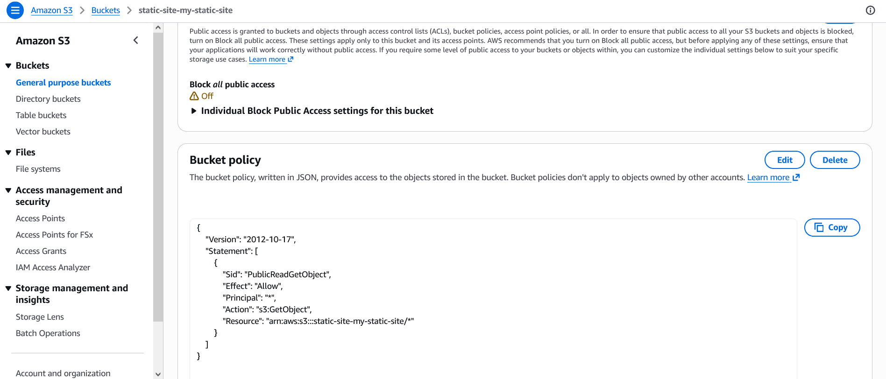

Após corrigir a configuração, o bucket passou a aceitar leitura pública dos objetos, mantendo apenas a permissão mínima necessária sem abrir escrita ou exclusão para o público.

---

### 7️⃣ Bucket vazio → 404 NoSuchKey

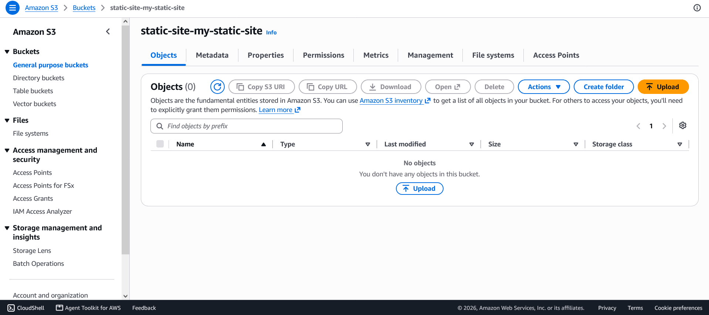

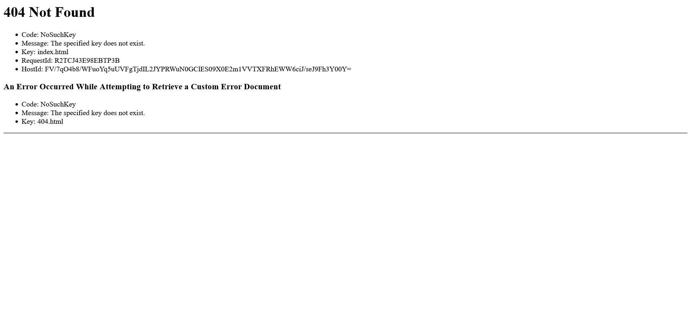

* **Erro:**
  ```
  404 Not Found
  Code: NoSuchKey
  Key: index.html
  ```
* **Causa raiz:** o bucket não tinha nenhum arquivo `index.html`/`404.html`. Eu havia provisionado a infraestrutura pelo Terraform, mas não tinha automatizado o envio dos arquivos no pipeline.
* **Solução:** criei os arquivos estáticos (`site/index.html`, `site/404.html`) e fiz o upload para o bucket.

> 💡 **Aprendizado:** entendi na prática a separação entre **provisionamento de infraestrutura** (IaC) e **deploy de conteúdo/aplicação**. são duas etapas distintas de uma esteira de entrega contínua, e uma não substitui a outra.

---

### 8️⃣ Upload do conteúdo estático

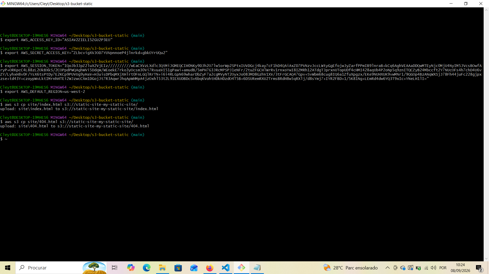
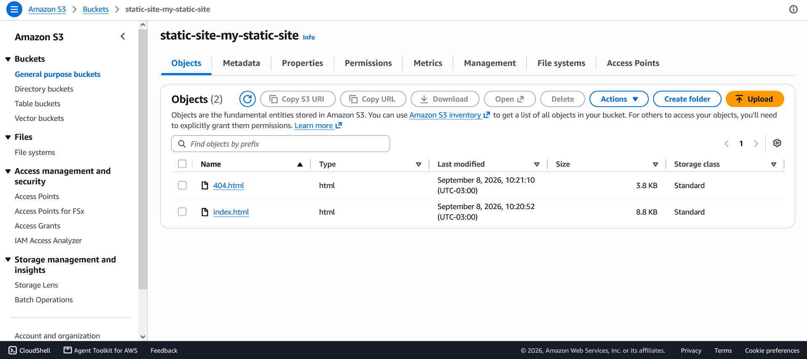

Realizei o upload manual inicial via CLI para validar:

```bash
aws s3 cp site/index.html s3://static-site-my-static-site/
aws s3 cp site/404.html s3://static-site-my-static-site/
```

Depois automatizei essa etapa dentro do workflow com `aws s3 sync`, garantindo que toda nova Issue publique automaticamente o conteúdo mais recente da pasta `site/`:

```yaml
- name: Upload Site Content
  run: |
    aws s3 sync ./site s3://static-site-${{ env.BUCKET_NAME }}/ --delete
```

> 💡 **Aprendizado:** percebi que automatizar o `s3 sync` no pipeline transforma um deploy manual e repetitivo em **entrega contínua** cada Issue passa a gerar, de forma consistente, o mesmo resultado.

---

### 9️⃣ `GITHUB_TOKEN` sem permissão de escrita


* **Erro:**
  ```
  RequestError [HttpError]: Resource not accessible by integration
  status: 403
  'x-accepted-github-permissions': 'issues=write; pull_requests=write'
  ```
* **Causa raiz:** identifiquei que o `GITHUB_TOKEN` automático do GitHub Actions vem, por padrão, apenas com permissão de **leitura**. O último *step* do workflow precisa comentar na Issue, o que exige escrita.
* **Solução:** declarei explicitamente as permissões necessárias no início do arquivo de workflow:

```yaml
permissions:
  contents: read
  issues: write
```

> 💡 **Aprendizado:** confirmei que **menor privilégio** não se aplica só a contas na nuvem, tokens de automação/CI seguem a mesma lógica, e escalar permissão só deve acontecer quando explicitamente necessário.

---

### 🔟 Site publicado com sucesso


Com todos os ajustes aplicados, consegui rodar o pipeline completo de ponta a ponta: da Issue aberta até o site acessível publicamente pelo endpoint do S3.

> 💡 **Aprendizado:** validei que, mesmo sem provisionar nenhum servidor web, o site suporta picos de tráfego sem qualquer intervenção minha,uma demonstração direta de **elasticidade** e **escalabilidade** de um serviço gerenciado. Isso me mostrou o valor real da IaC: da Issue aberta até o site no ar, todo o processo foi repetível, consistente e sem toque manual no console da AWS.

---

## ⚙️ Workflow final (`.github/workflows/provision-s3-static-site.yaml`)

```yaml
name: Create S3 Static Site

on:
  issues:
    types: [opened]

permissions:
  contents: read
  issues: write

jobs:
  provision-s3:
    runs-on: ubuntu-latest
    steps:
      - name: Checkout Repository
        uses: actions/checkout@v4

      - name: Configure AWS Credentials
        uses: aws-actions/configure-aws-credentials@v4
        with:
          aws-access-key-id: ${{ secrets.AWS_ACCESS_KEY_ID }}
          aws-secret-access-key: ${{ secrets.AWS_SECRET_ACCESS_KEY }}
          aws-session-token: ${{ secrets.AWS_SESSION_TOKEN }}
          aws-region: us-west-2

      - name: Setup Terraform
        uses: hashicorp/setup-terraform@v3

      - name: Extract Bucket Name from Issue
        id: get_bucket
        run: |
          CLEAN_NAME=$(echo "${{ github.event.issue.title }}" | tr '[:upper:]' '[:lower:]' | tr -cd 'a-z0-9-')
          echo "BUCKET_NAME=$CLEAN_NAME" >> $GITHUB_ENV

      - name: Run Terraform
        run: |
          cd terraform/s3_bucket_static_pasta
          terraform init
          terraform apply -auto-approve -var="bucket_name=${{ env.BUCKET_NAME }}"

      - name: Upload Site Content
        run: |
          aws s3 sync ./site s3://static-site-${{ env.BUCKET_NAME }}/ --delete

      - name: Comment on Issue
        uses: actions/github-script@v6
        with:
          github-token: ${{ secrets.GITHUB_TOKEN }}
          script: |
            github.rest.issues.createComment({
              issue_number: context.issue.number,
              owner: context.repo.owner,
              repo: context.repo.repo,
              body: 'O Bucket S3 foi provisionado via Terraform e os arquivos estáticos foram publicados com sucesso!'
            })
```

---

## 🧱 Terraform final (`terraform/s3_bucket_static_pasta/main.tf`)

```hcl
terraform {
  required_providers {
    aws = {
      source  = "hashicorp/aws"
      version = "3.75.1"
    }
    null = {
      source  = "hashicorp/null"
      version = "~> 3.2"
    }
  }
}

variable "bucket_name" {
  type        = string
  description = "Nome do bucket vindo da Issue do GitHub"
}

provider "aws" {
  region = "us-west-2"
}

locals {
  full_bucket_name = "static-site-${var.bucket_name}"
}

resource "null_resource" "static_site_bucket" {
  triggers = {
    bucket_name = local.full_bucket_name
  }

  provisioner "local-exec" {
    command = <<-EOT
      set -e
      aws s3api create-bucket \
        --bucket ${local.full_bucket_name} \
        --region us-west-2 \
        --create-bucket-configuration LocationConstraint=us-west-2

      aws s3api put-public-access-block \
        --bucket ${local.full_bucket_name} \
        --public-access-block-configuration BlockPublicAcls=false,IgnorePublicAcls=false,BlockPublicPolicy=false,RestrictPublicBuckets=false

      aws s3api put-bucket-ownership-controls \
        --bucket ${local.full_bucket_name} \
        --ownership-controls '{"Rules":[{"ObjectOwnership":"BucketOwnerPreferred"}]}'

      aws s3api put-bucket-acl \
        --bucket ${local.full_bucket_name} \
        --acl public-read

      aws s3api put-bucket-website \
        --bucket ${local.full_bucket_name} \
        --website-configuration '{"IndexDocument":{"Suffix":"index.html"},"ErrorDocument":{"Key":"404.html"}}'
    EOT
  }
}

output "website_endpoint" {
  value      = "${local.full_bucket_name}.s3-website-us-west-2.amazonaws.com"
  depends_on = [null_resource.static_site_bucket]
}
```

---

## 🔁 Como reproduzir o projeto

1. Faça um fork/clone deste repositório.
2. Configure os *Secrets* do repositório (`Settings → Secrets and variables → Actions`):
   - `AWS_ACCESS_KEY_ID`
   - `AWS_SECRET_ACCESS_KEY`
   - `AWS_SESSION_TOKEN`
3. Ajuste `Settings → Actions → General → Workflow permissions` para permitir leitura e escrita, caso a organização restrinja por padrão.
4. Coloque o conteúdo do seu site em `site/index.html` e `site/404.html`.
5. Abra uma nova *Issue* com o nome desejado para o bucket — o pipeline faz o resto.

---

## 🔮 Possíveis melhorias futuras

- Adicionar checagem de idempotência no `null_resource` (evitar erro se o bucket já existir ao reabrir a Issue com o mesmo nome).
- Migrar de S3 website hosting público para **CloudFront + Origin Access Control**, mais seguro para produção fora do ambiente acadêmico.
- Adicionar step de `terraform destroy` disparado pelo fechamento da Issue, para limpeza automática de recursos.